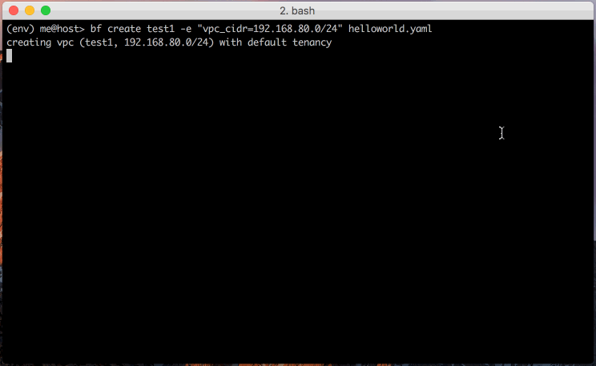

.. botoform documentation master file, created by
   sphinx-quickstart on Wed Jul  1 00:41:29 2015.
   You can adapt this file completely to your liking, but it should at least
   contain the root `toctree` directive.

.. _botoform:

Botoform
########

**Manage infrastructure running on AWS using YAML templates.**

Botoform_ provides tools to manage the lifecycle of related AWS resources.
We use a simple YAML schema to document resources as infrastructure.
The YAML schema has self documenting qualities and works with version control.

In this example we use the :ref:`bf` :ref:`bf create` tool to build
the infrastructure defined in ``helloworld.yaml``:

The :ref:`bf` tools use YAML architecture to create and manage environments.
Botoform_ allows reproduction of any environment, no matter how complex.

Botoform_ abstracts and enriches the Boto3_ and Botocore_ projects.

Quickstart
==========

.. toctree::
   :maxdepth: 2
   :glob:

   guides/quickstart.rst

Tools
=====

.. toctree::
   :maxdepth: 3
   :glob:

   tools/index.rst

Schema Reference
================

End user YAML Schema Reference for describing VPCs and related AWS resources.

.. toctree::
   :maxdepth: 2
   :glob:

   schema/index.rst

You may optionally use :ref:`Jinja2` in your YAML config.

Developer Reference
===================

Developer Python Library Reference for modifying or extending Botoform.

.. toctree::
   :maxdepth: 2
   :glob:

   reference/index.rst

.. these currently don't work / exists
   :ref:`genindex`
   :ref:`modindex`

.. external link references:

.. _Botocore: http://botocore.com
.. _Boto3: http://boto3.com

